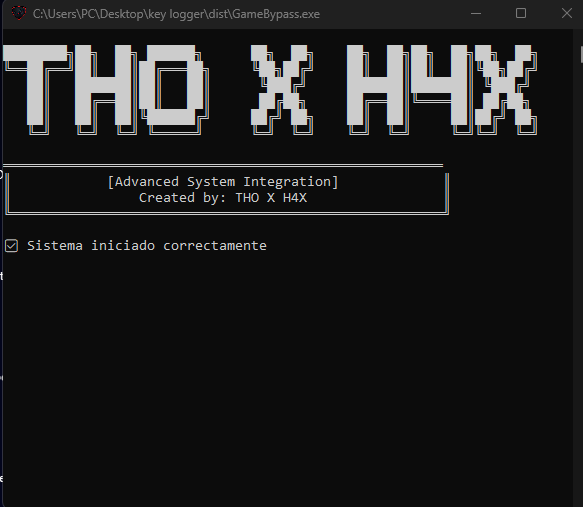
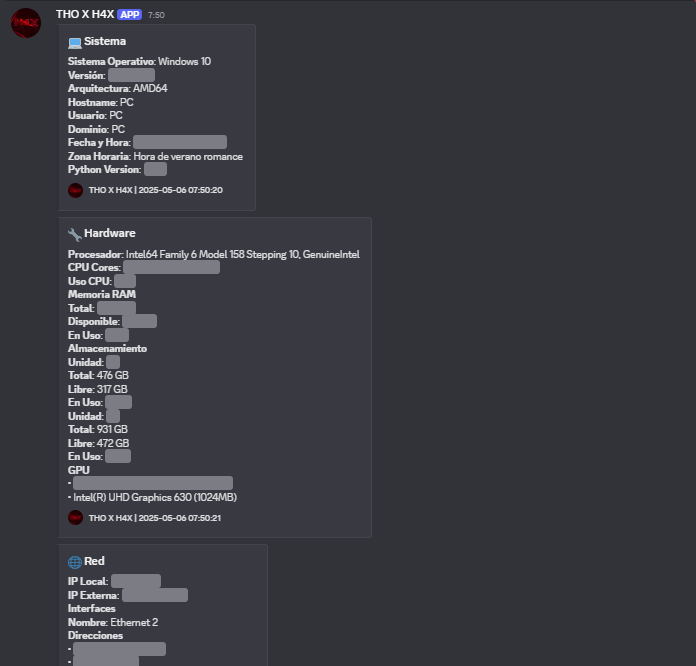
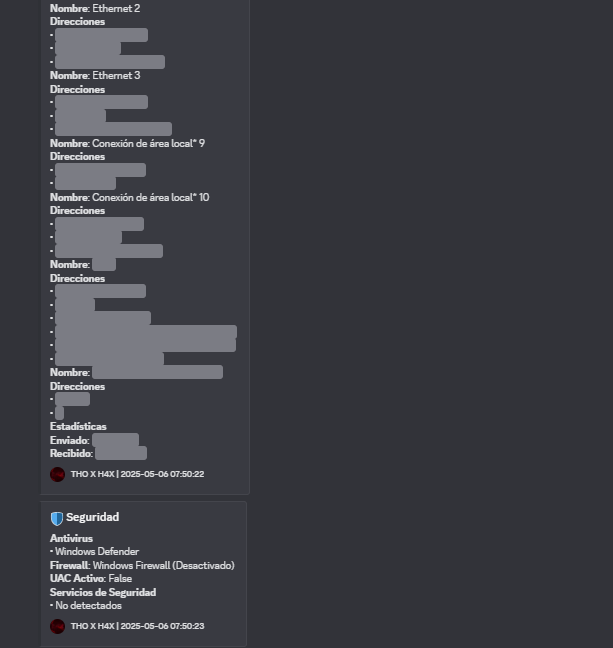
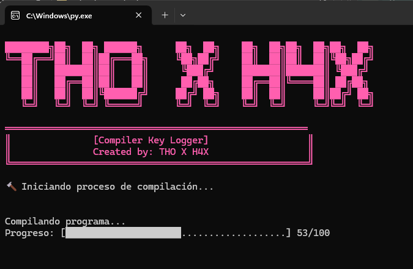

<div align="center">
  
  
  # ⌨️ KEY LOGGER [ THO X H4X ]
  
  <div class="preview-gallery" style="display: grid; grid-template-columns: repeat(2, 1fr); gap: 10px; max-width: 800px; margin: 20px auto;">
    
    
    
    
  </div>
  
  ### 🎥 Demo en Video
  
  []()
</div>

---

[](https://discord.gg/tfRuSC52Da)
[](https://youtu.be/EoNmCH-dLJY)
[](https://www.python.org/ftp/python/3.11.0/python-3.11.0-amd64.exe)

## 📋 Descripción

⌨️ Key Looger es una herramienta de monitoreo y recopilación de información del sistema que permite obtener datos detallados sobre la configuración y el estado del equipo.

## ⚙️ Información Recopilada

- 💻 **Sistema**
  - Sistema Operativo y versión
  - Arquitectura
  - Hostname
  - Usuario y dominio
  - Zona horaria

- 🔧 **Hardware**
  - Procesador y núcleos
  - Uso de CPU
  - Memoria RAM
  - Almacenamiento
  - GPU

- 🌐 **Red**
  - IP local y externa
  - Interfaces de red
  - Estadísticas de tráfico

- 🛡️ **Seguridad**
  - Antivirus instalados
  - Estado del firewall
  - Servicios de seguridad
  - Estado UAC

## 🚀 Configuración del Entorno

### Configurar Entorno Virtual (Windows 10/11)

#### Requisitos Previos
- Windows 10 o Windows 11
- Python 3.8 o superior ([Descargar Python](https://www.python.org/ftp/python/3.8.0/python-3.8.0-amd64.exe))

#### Pasos de Configuración

1. Abre PowerShell como administrador:
   - Presiona `Windows + X`
   - Selecciona "Windows PowerShell (Admin)" o "Terminal (Admin)"

2. Verifica la instalación de Python:
```powershell
python --version
# Debería mostrar Python 3.8 o superior
```

3. Actualiza pip:
```powershell
python -m pip install --upgrade pip
```

4. Crea un nuevo entorno virtual:
```powershell
python -m venv .venv --upgrade-deps
```

5. Activa el entorno virtual:
```powershell
# Para PowerShell:
Set-ExecutionPolicy -ExecutionPolicy RemoteSigned -Scope CurrentUser
.\.venv\Scripts\Activate.ps1

# Para CMD:
.\.venv\Scripts\activate.bat
```

6. Confirma la activación:
```powershell
# Deberías ver (.venv) al inicio de la línea
where python
# Debería mostrar la ruta dentro de .venv
```

> 💡 **Solución de Problemas**:
> - Si recibes errores de permisos, asegúrate de usar PowerShell como administrador
> - Si el script está bloqueado, ejecuta: `Unblock-File -Path .\.venv\Scripts\Activate.ps1`
> - Para desactivar el entorno: `deactivate`

## 🚀 Instalación

1. Clona el repositorio:
```bash
https://github.com/HANNIBAL-THO/KEY-LOGGER/
cd KEY-LOGGER
```

2. Instala las dependencias:
```bash
pip install -r requirements.txt
```

3. Ejecuta el script de compilación:
```bash
python compile.py
```

## 🔨 Uso

1. Ejecuta el archivo generado `GameBypass.exe`
2. La herramienta iniciará automáticamente
3. Los datos recopilados se enviarán al webhook configurado

## 🎥 Tutorial en Video

[](https://youtu.be/your_video_id)

## 💬 Soporte

¿Necesitas ayuda? ¡Únete a nuestro servidor de Discord!

[](https://discord.gg/tfRuSC52Da)

## ⚠️ Aviso Legal

Esta herramienta fue creada con fines educativos y de investigación. El autor no se hace responsable del mal uso o aplicación indebida que se le pueda dar a esta herramienta.

**IMPORTANTE:** El uso de esta herramienta para actividades maliciosas o sin el consentimiento explícito del propietario del sistema está estrictamente prohibido y puede ser ilegal en su jurisdicción.

## 📜 Licencia

Este proyecto está bajo la Licencia MIT. Ver el archivo [LICENSE](LICENSE) para más detalles.

---
Created with ❤️ by THO X H4X
